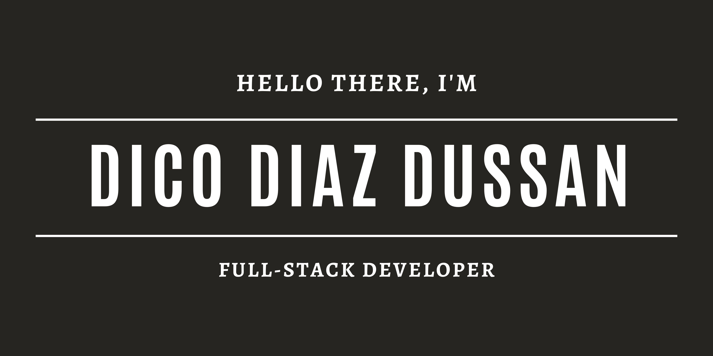

## 👨🏻‍💻 About Me

- I like experimenting with new technologies and building small projects.
- Currently a Microverse student.
- Electronic engineering graduate with a previous career as a RAN engineer.
- Looking for new opportunities as a Full Stack Developer.
- Watching movies and taking long walks are my hobbies.
- I believe a day of hiking and nature is the ultimate solution for stress.

## 🛠 Tech Stack

- JavaScript | Ruby | Rails | React | Redux
- Java | JDBC | JSF | Java EE | JPA | Spring
- RSpec | Bootstrap | Capybara | Selenium
- VSCode | Git

## 📊 Some statistics

## 🤝🏻 Connect with Me

 

